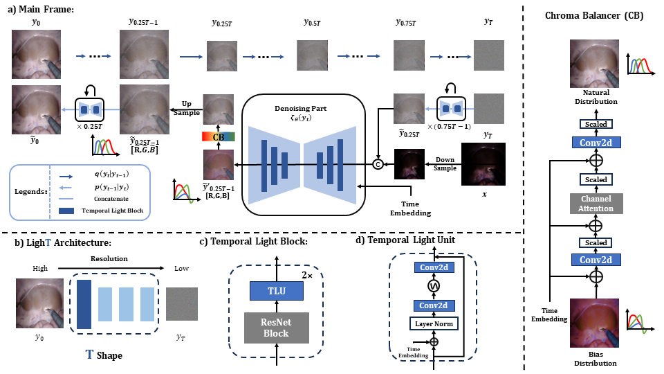
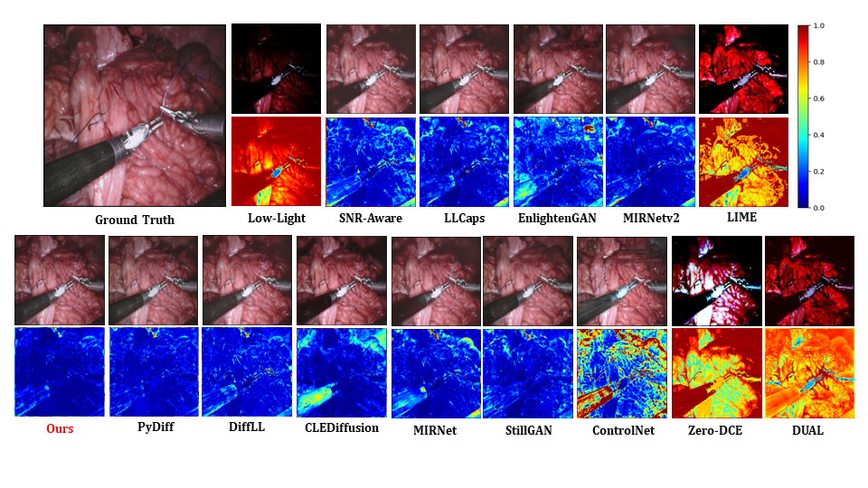
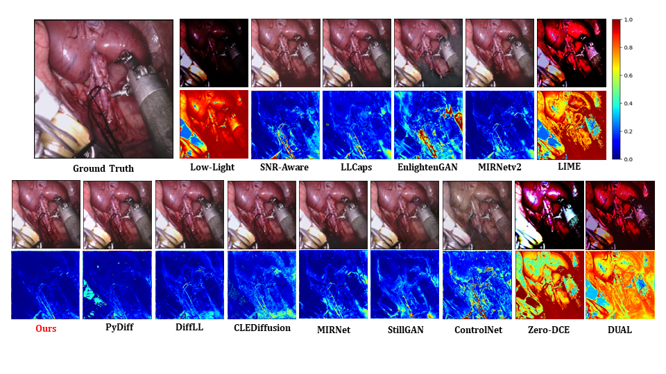

<div align="center">
<samp>
  
<h1> LighTDiff: Surgical Endoscopic Image Low-Light Enhancement with T-Diffusion </h1>

<h4> <b>Tong Chen†, Qingcheng Lyu†, Long Bai†</b>, Erjian Guo, Huxin Gao, Xiaoxiao Yang, Hongliang Ren, and Luping Zhou </h3>

<h4> Medical Image Computing and Computer Assisted Intervention (MICCAI) 2024 </h3>
 <h3> Best Paper Runner-Up Award </h3>
</samp>

| **[[```arXiv```](<https://arxiv.org/abs/2405.10550>)]** | **[[```Paper```](<https://link.springer.com/chapter/10.1007/978-3-031-72089-5_35>)]** |
|:-------------------:|:-------------------:|


</div>     

## Update
**[01/10/2025] Our Dataset is now available in [here](https://drive.google.com/drive/folders/1Qy66-SVR89uMXrz0OEy6a2Tcrdw7HuA1?usp=drive_link).**

**[10/9/2024] We received MICCAI2024 Best Paper Runner-Up!**

**[9/3/2024] Our work received Oral Presentation on MICCAI2024!**

**[7/20/2024] Fixed some bugs.**

**[5/13/2024] Our work got early accepted by MICCAI2024!**

**[5/17/2024] Our code is now available!**

## Schematics

## Results


## Pre-installation
```Install step
conda create -n lightdiff python=3.10
conda activate lightdiff
conda install pytorch==2.0.1 torchvision torchaudio cudatoolkit==12.1 -c pytorch
cd BasicSR-light
pip install -r requirements.txt
BASICSR_EXT=True sudo $(which python) setup.py develop
cd ../LighTDiff
pip install -r requirements.txt
BASICSR_EXT=True sudo $(which python) setup.py develop
```

## Test
```
python lightdiff/train.py -opt configs/test.yaml
```
## Train
```
python lightdiff/train.py -opt configs/train.yaml
```
